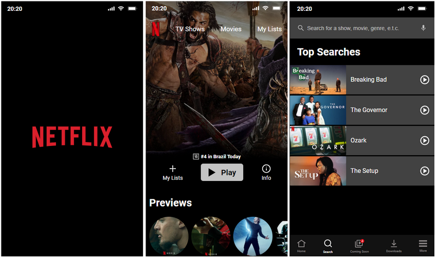

# Projeto Clonando a Netflix
Desafio para criação de um clone do site Netflix, em versão mobile, baseado em um projeto apresentado no FIGMA.

## Tecnologias utilizadas
- HTML
- CSS
- GIT
- GITHUB
- Vercel (deploy)

## Padronizações
- HTML: Semantic TAGS
- CSS: BEM (Block Element Modifier)
- GIT: Conventional Commits

## Site
Para visualizar o projeto, acesse: [Netflix Clone test page](https://netflix-clone-zaguetto.vercel.app/)

## Screenshots

